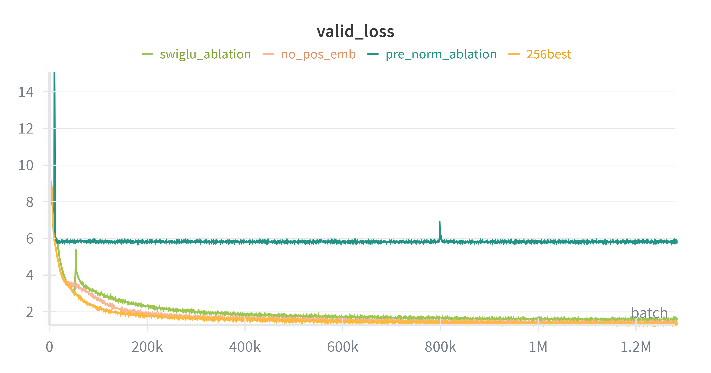

# CS336 Spring 2025 Assignment 1: Basics
Train a small language model which can generate simple stories in English.

## Directory structure
- [data/](data/) Datasets and preprocessed datas
- [implements/](implements/)
- [solutions/](solutions/) Some scripts for solving problems in assignment and their output
- [writeup.md](writeup.md) Answer to the problems

## Training
[Setup](#setup) first, or you can download [checkpoint]() and [generate text](#generating) without training

### Train BPE
You can jump this step as bpe datas have been placed in [data/](data/)

```bash
cd solutions
./test_train_bpe.sh
mv bpe-TinyStoriesV2-GPT4-train.pkl ../data
cd ..
```

### Tokenize datasets
You can download [tokenized datasets]() and jump this step

```bash
cd solutions
uv run tokenize_dataset.py
cd ..
```

### Experiments

Details in [here](writeup.md#7-experiments)

Valid loss of ablations:


### Train model
You should sign up a [Weights & Biases](https://wandb.ai/home) account and replace 'entity' of WANDB_CONFIG in [solutions/trainer.py](solutions/trainer.py) and export WANDB_API_KEY. It's for logging training.

```bash
uv run solutions/trainer.py --config-path configs/std-config.yaml --title 'train-on-TinyStoriesV2'
```

## Generating
The model is trained on [TinyStoriesV2](https://arxiv.org/pdf/2305.07759), so it can write simple story but cannot solve math problems or coding

```bash
uv run solutions/generate_text.py -c configs/std-config.yaml -t data/bpe-TinyStoriesV2-GPT4-train.pkl <your_prompt>

# example
$ uv run solutions/generate_text.py -c configs/std-config.yaml -t data/bpe-TinyStoriesV2-GPT4-train.pkl -m 256 'Sam got up early this morning'
 and flew away with his friends. 
After flying back, all of the birds were happy to see Sam and wished him luck to use his shiny license again. Sam's friends thanked him for taking them to see how he helped them, and Sam was the first to use his shiny license to help him reach out the wind, speed, and play in the air.
The moral of the story is that when we all support someone, we can always find a way to help out and use your own special ways to use your things.
<|endoftext|>
```

---
---

> README of the [origin repository](https://github.com/stanford-cs336/assignment1-basics.git) from here, mainly about problems and environment setup.

For a full description of the assignment, see the assignment handout at
[cs336_spring2025_assignment1_basics.pdf](./cs336_spring2025_assignment1_basics.pdf)

If you see any issues with the assignment handout or code, please feel free to
raise a GitHub issue or open a pull request with a fix.

## Setup

### Environment
We manage our environments with `uv` to ensure reproducibility, portability, and ease of use.
Install `uv` [here](https://github.com/astral-sh/uv) (recommended), or run `pip install uv`/`brew install uv`.
We recommend reading a bit about managing projects in `uv` [here](https://docs.astral.sh/uv/guides/projects/#managing-dependencies) (you will not regret it!).

You can now run any code in the repo using
```sh
uv run <python_file_path>
```
and the environment will be automatically solved and activated when necessary.

### Run unit tests


```sh
uv run pytest
```

Initially, all tests should fail with `NotImplementedError`s.
To connect your implementation to the tests, complete the
functions in [./tests/adapters.py](./tests/adapters.py).

### Download data
Download the TinyStories data and a subsample of OpenWebText

``` sh
mkdir -p data
cd data

wget https://huggingface.co/datasets/roneneldan/TinyStories/resolve/main/TinyStoriesV2-GPT4-train.txt
wget https://huggingface.co/datasets/roneneldan/TinyStories/resolve/main/TinyStoriesV2-GPT4-valid.txt

wget https://huggingface.co/datasets/stanford-cs336/owt-sample/resolve/main/owt_train.txt.gz
gunzip owt_train.txt.gz
wget https://huggingface.co/datasets/stanford-cs336/owt-sample/resolve/main/owt_valid.txt.gz
gunzip owt_valid.txt.gz

cd ..
```
