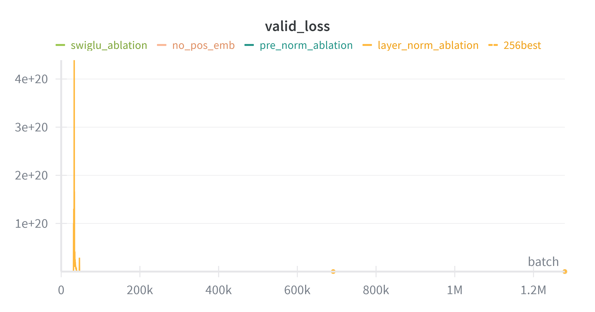
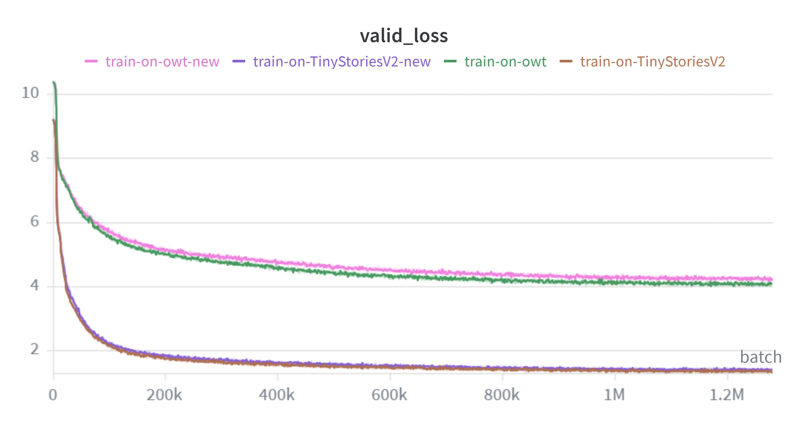

# writeup
## 2 BPE 
### 2.1
- (a) '\x00'
- (b) It's stringify of `__str__()` here.
- (c) '\x00' was hidden.

### 2.2
- (a) The range of utf-8 is much smaller.
- (b) it decodes bytes by bytes independently, but some code is longer than a byte. '牛'.encode('utf-8')
- (c) b'\xc0\x80'

### 2.5 Problem (train_bpe_tinystories): BPE Training on TinyStories
- script in solutions/test_train_bpe.sh
- (a) (with multiprocess in pre_tokenizer)
  - time: 38.12 s (wall clock), memory: 324692 kbytes (by usr/bin/time)
  - longest tokens: [b' accomplishment', b' disappointment', b' responsibility']
- (b) (by cProfile)
  - train_bpe: 27.9 s
    - pre_tokenize: 19.6 s
    - FasterCounter: 20+ s (?)

### Problem (train_bpe_expts_owt): BPE Training on OpenWebText
- my os break down few times
- (a)
  - use FasterCounter.most_common_1() with O(logn), so the whole token merging is O(nlogn)
  - it seems that merging is slower at the beginning, since more count of token pairs need to change.
  - it can be proved that the count of token pairs no increase with merging.
  - time: 2h22m, memory: 42319768kbytes (by usr/bin/time)
  - longest tokens: [b'\xc3\x83\xc3\x82\xc3\x83\xc3\x82\xc3\x83\xc3\x82\xc3\x83\xc3\x82\xc3\x83\xc3\x82\xc3\x83\xc3\x82\xc3\x83\xc3\x82\xc3\x83\xc3\x82\xc3\x83\xc3\x82\xc3\x83\xc3\x82\xc3\x83\xc3\x82\xc3\x83\xc3\x82\xc3\x83\xc3\x82\xc3\x83\xc3\x82\xc3\x83\xc3\x82\xc3\x83\xc3\x82' ('ÃÂÃÂÃÂÃÂÃÂÃÂÃÂÃÂÃÂÃÂÃÂÃÂÃÂÃÂÃÂÃÂ' in utf-8), b'----------------------------------------------------------------']
- (b) 

### Time complexity analysis
- O(nlogn), n is the number of pre-token.
- | dataset | pre-token | time | t / (p * log(p))
  | - | - | - | - |
  | tinystories | 59933 | 38.12s | 4.01e-5 |
  | owt | 6601892 | 2h22m | 5.70e-5 |
  | owt(10000 vocab end) | 6601892 | 1h58m | 4.72e-5 |
- With the impact of python gc and cpu hopping, the time complexity fit data very well.

### 2.7 Problem (tokenizer_experiments)
- (a)(b) compression ratio
  | tokenizer \ docs | ts | owt |
  | - | - | - |
  | ts | 4.03 | 3.38 |
  | owt | 3.96 | 4.39 |

- (c) throughput
  | tokenizer \ docs | ts | owt |
  | - | - | - |
  | ts | 2.4e5 | 2.5e5 |
  | owt | 2.3e5 | 2.2e5 |

  - m = 825GB = 825 * (1024 ** 3) bytes = 885837004800 bytes
  - m / v = 3.9e6 s = 1069 h

- (d) 2 ** 16 = 65536, which greater than most vocab_size. Also, it is 2 bytes and easy to store.

## 3 Transformer
### 3.6 Problem (transformer_accounting)
- script in solutions/transformer_accounting.py
- (a) paras: 2127057600, memory: 7.9 GB
- (b) total_flops=4,352,275,251,200
```py
matrix_multiplies = {
    # layers_tuple: n, m, p
    # ...
    ('layers', '47', 'attn', 'q_proj'): (1024, 1600, 1600),
    ('layers', '47', 'attn', 'k_proj'): (1024, 1600, 1600),
    ('layers', '47', 'attn', 'v_proj'): (1024, 1600, 1600),
    ('layers', '47', 'attn', 'output_proj'): (1024, 1600, 1600),
    # QK
    ('layers', '47', 'attn'): (1024, 1024, 64, 25),
    ('layers', '47', 'ffn', 'w1'): (1024, 1600, 6400),
    ('layers', '47', 'ffn', 'w3'): (1024, 1600, 6400),
    ('layers', '47', 'ffn', 'w2'): (1024, 6400, 1600),
    ('lm_head',): (1024, 1600, 50257)
}
```
- (c) 
  - k := 2 * 1024 * 1600 * 1600
  - 1x TransformerBlock: 
    - attn: 4 * 2 * 1024 * 1600 * 1600 + 1024 * 1024 * 64 * 25 = 4.8k
    - ffn: 3 * 2 * 1024 * 1600 * 6400 = 12k
  - lm_head: 2 * 1024 * 1600 * 50257 = 31k
  - ffn in blocks requires most FLOPs
- (d) analysis
  - more: blocks, ffn
  - less: lm_head, attn
- (e) attn more
```
GPT-2 small :
lm_head   :       79,047,426,048 | 23.93 %
attn      :       77,309,411,328 | 23.41 %
ffn       :      173,946,175,488 | 52.66 %

GPT-2 medium :
lm_head   :      105,396,568,064 | 10.74 %
attn      :      257,698,037,760 | 26.25 %
ffn       :      618,475,290,624 | 63.01 %

GPT-2 large :
lm_head   :      131,745,710,080 |  6.10 %
attn      :      579,820,584,960 | 26.83 %
ffn       :    1,449,551,462,400 | 67.07 %

GPT-2 XL :
lm_head   :      164,682,137,600 |  3.78 %
attn      :    1,167,694,233,600 | 26.83 %
ffn       :    3,019,898,880,000 | 69.39 %

GPT-2 XL + :
lm_head   :    2,634,914,201,600 |  2.43 %
attn      :   57,337,813,401,600 | 52.95 %
ffn       :   48,318,382,080,000 | 44.62 %
```

## 4 Training
### 4.2 Problem (learning_rate_tuning)
- 1e1: slower
- 1e2: faster
- 1e3: diverge

### 4.3 Problem (adamwAccounting)
- (a)
  - parameters: $ d\_model \cdot (14 \cdot num\_layer \cdot d\_model + vocab + 1) $ (*4B)
    - Transformer block: $ 14 \cdot d\_model^2 $
      - RMSNorm: $ d\_model $
      - MHA: $ 4 \cdot d\_model^2 $
        - proj: $ 3 \cdot d\_model^2 $
        - $ Q^TK $: $ 0 $
        - softmax: $ 0 $
        - weighted sum of values: $ 0 $
        - output projection: $ d\_model^2 $
      - Position-wise feed-forward: $ 8 \cdot d\_model^2 $
        - W matrix: $ 8 \cdot d\_model^2 $
        - SiLU: $ 0 $
    - final RMSNorm: $ d\_model $
    - output embedding: $ d\_model \cdot vocab $
    - cross-entropy on logits: $ 0 $
  - activations: $ b \cdot c \cdot (2 \cdot l \cdot c \cdot h + (16 \cdot l + 1) \cdot d\_model + vocab + 1) $ (*4B)
    - Transformer block: $ b \cdot c \cdot (2 \cdot c \cdot h + 16 \cdot d\_model) $
      - RMSNorm: $ b \cdot c \cdot d\_model $
      - MHA: $ b \cdot c \cdot (2 \cdot c \cdot h + 5 \cdot d\_model) $
        - proj: $ 3 \cdot b \cdot c \cdot d\_model $
        - $ Q^TK $: $ b \cdot c^2 \cdot h $
        - softmax: $ b \cdot c^2 \cdot h $
        - weighted sum of values: $ b \cdot c \cdot d\_model $
        - output projection: $ b \cdot c \cdot d\_model $
      - Position-wise feed-forward: $ 9 \cdot b \cdot c \cdot d\_model $
        - W1 matrix multiply: $ 4 \cdot b \cdot c \cdot d\_model $
        - SiLU: $ 4 \cdot b \cdot c \cdot d\_model $
        - W2 matrix multiply: $ b \cdot c \cdot d\_model $
    - final RMSNorm: $ b \cdot c \cdot d\_model $
    - output embedding: $ b \cdot c \cdot vocab $
    - cross-entropy on logits: $ b \cdot c $
  - gradients: (= parameters)
  - optimizer state: (= 2 parameters)
  - total: (= 4 parameters + activations)
    - $ 4 \cdot d\_model \cdot (14 \cdot num\_layer \cdot d\_model + vocab + 1) + b \cdot c \cdot (2 \cdot l \cdot c \cdot h + (16 \cdot l + 1) \cdot d\_model + vocab + 1) $ (*4B)
- (b) $ 15'311'908'864 \cdot batch\_size + 28'811'750'400 $  (*4B), max batch size: 3
  ```py
  def memory_used(s,d,l,v,h,b,c):
      return s*(4*d*(14*l*d+v+1)+b*c*(2*l*c*h+(16*l+1)*d+v+1))
  ```
- (c) (= 14 parameters)
- (d) 4475 days

## 7 Experiments
### 7.2 Problem (learning_rate)


```bash
# 1) old script (batch_size: 256)
git checkout f2ae9e1
# at base dir
uv run solutions/trainer.py --config-path configs/std-config.yaml --test
# go back
git checkout -

# 2) new script without running
# batch_size: {1,16,64,256,512}
uv run solutions/lr_tuning_experiment.py --config-path configs/std-config.yaml
```

- (a) lr = 0.002819 (batch_size = 256)
- (b) best = 0.002819, best <= min_diverge <= 0.00712

### 7.2 Problem (batch_size_experiment)


| batch_size | best_lr | min_valid_loss |
| - | - | - |
| 1 | (killed since too slow) |
| 16 | 3.74e-4 | 1.212 |
| 64 | 6.60e-4 | 1.332 |
| 256 | 2.82e-3 | 1.361 |
| 512 | 5.62e-3 | 1.557 |

The greater batch_size is, the greater best_lr is and the greater valid_loss is.

### 7.3 Problem (ablation)



The impact of RMSNorm: make it easy to train

### 7.4 Problem (main_experiment)


> Here I found a bug in tokenizer calling which tokenizes <|endoftext|> as ordinary word. I have fixed it (commit 6ccd99c), but no redo foregoing experients. This is because the bug hardly affect valid loss.

Model is too small that cannot fit owt well.

```bash
uv run solutions/trainer.py --config-path configs/std-config.yaml --title 'train-on-TinyStoriesV2'
uv run solutions/trainer.py --config-path configs/owt-config.yaml --title 'train-on-owt'
```

### 7.2 Problem (generate)
```bash
uv run solutions/generate_text.py -c configs/std-config.yaml -t data/bpe-TinyStoriesV2-GPT4-train.pkl <prompt>
uv run solutions/generate_text.py -c configs/owt-config.yaml -t data/bpe-owt_train.pkl <prompt>
```

Model trained on owt 

```bash
$ uv run solutions/generate_text.py -c configs/std-config.yaml -t data/bpe-TinyStoriesV2-GPT4-train.pkl 'Sam got up early this morning'
 and flew away with his friends. 
After flying back, all of the birds were happy to see Sam and wished him luck to use his shiny license again. Sam's friends thanked him for taking them to see how he helped them, and Sam was the first to use his shiny license to help him reach out the wind, speed, and play in the air.
The moral of the story is that when we all support someone, we can always find a way to help out and use your own special ways to use your things.
<|endoftext|>

uv run solutions/generate_text.py -c configs/owt-config.yaml -t data/bpe-owt_train.pkl 'Sam got up early this morning'
 with the incredible chance to cover our stump with cheer!

The luxury for the new tailings will always be the next Grand Acura & Bereo Tacos Vallo i i li

The final breakdown of the fresco is a lot of sour yet. Three the set of icons such as the 42ft A-thousand were playing together, or all the bands, which made a great sense of great art work the way the animation ends.

We have a pretty good cast for DC Jabbik who said that the frame-marks that work together to their environment felt like something else was minimal and that the design of the logo is apparent and had to change it to them. We have always said so: As You part with the design for Sony HD, and we're a great fan. That was so awesome, but so on the in-game we were here on that one, if we wanted to do this, our first feature could have made it worth it.

The next thing to do to get the feeling invested on our outstanding system and the very young got thrown in the middle of a table, or it was an open play, and we gave them a more ironier tone. If we didn't want to go to the Grand Talks, we got the base game. We've still got the idea that we were a high character development team when we were in an arcade mode and the idea of using Nintendo on an Xbox or Live section is how to make the mixer's creations and the systems that own an arcade that does. We had five work permits and a 9/10 internal release process (not after as much as it would seem like we were all developers, and I saw on some of the Switch) became available and added some to E-Form. I mentioned, at least, when the Nintendo failed to make their RTS, I'd have to figure it out without them... the console came back in that direction, and with the quality of those pieces, no camera would be totally fine, as I chose for being my own gamer. It seemed great to be a job as well, but we don't get to do our best."

Those days weren't just there. To something about the benefits in front of, E-Forms is not important. We were very happy to keep a non-player game getting go-down.

* Improvements are essentially the most convincing and naturally occurring. I wanted to keep the games done. I still get the maximum amount of SC2. It's just about the most intuitive. From now on, focus on creating a scroungity of Cloud9. Honestly, your smart way to work with the Laptop+ instead of 1GHz.

"When I started to open the adventure of the MSWT, I felt like they had to really stay focused on your device all the time."

"I loved them that made me a fit, and we decided to do a quick life -- just let it be. They're this little art!"

In Game 7's final phase, Commander #2 backers were set to buy the VGB, a Kickstarter/ build custom Siaors into 3/4/8PM as well. Now that we get the extra credit, we're creating an RPG for AAFS, a pool that transforms a high standard auto base.

But when you take a multiplayer to someone like HP you're a lot better in the first 2DS you're going to have so much change in case! Still, what else is that, so it'll be more cheap and fun-loving biking the V8 Arena. I'm not the only one for ESL. I'm going to venture to Kickstarter (Gamma, PCX-as) to give you a nice promo and you'll get a little more interesting, too. You'd argue, we can be doing a lot of good things with your heroics, and want to know about ESL. I'm going to put it in it. You'll tell me what to do."

When it's launched, the game planner has put it onto their fingers and a close transition—I really don't have it on Steam's radar yet. One thing that was to work with this project was to do, I'm ready to go, while some gaming developers know the company is changing me. You're going to be thinking in six different ways.

One thing I just wish it would be about the original thing, as this brings to the hardware industry to Omnivacs. It's because you can almost always make it in a rare sci-fi franchise, so you need to use them? I actually want to give that done by myself. I don't want the family in this area. I really want to have a big business to do. So, I want it. I have my plan, and I always want that to be in a game, but it is important to do the same thing. Because sometimes you have a lot of talent, you can get more interesting things.

I only really want to do a game plan, but with a lot of interest in my game plan, I think, really difficult. I get so it's like, though. But when I look forward and I think to you, I think everyone with the highest level of Magic conceptions can do this in a certain way.

...

Obviously I'm not on the cards and if the deck holds a lot of void to the map, it'll be working when you're going on and you get to be organized. I'd call this in many ways if I want to move one of those decks with such fun.

What do you get the most money on an Egon?

Advertisement

I never gave the item. I wanted a name out of my own minds, and was there and it was a character-based character. There was so much space and had to trade it in the pocket. Some have really thought of it, but we had a sense of personality, at least, as we were it, the mid-schooler would be the best option for a winner at each other and is in the Hall of Fame game. So what happens next?

It was real time to take into account some strange things from them. Then what would you do to please? We are also mentally overwhelmed by our game because the game is of a great way to try and expand its core boundaries to figure out where the time is getting worked. I don't see the subtitle – I don't have all of them. I know that this is my perception that I can move it through the city or maybe even to find all kinds of fun and fun. But if someone says that to me, I'll have.

So it's when things are the same with which "property" is so great for college. I always ask you how fast I'll be. It's a few - but i can't make a game with that in my new skill. It's also nice for your skills and how to travel to your own building across the screen. Let's do this and have fun, but it's very often an even better choice. If they've ever been a part of the point, why are all what you're supposed to be?

You've probably seen a similar score in hand. But you have to help the game more with strong quality work. I recommend you in some way, to make a problem, to see what a particular skill you'd think, and you can even face paint, and then have those to do something else.

The terrain concepts really are. Here are some of the aspects that is possible to do this a bit, something that we should start out with (unlike, really, mentally) but I've found some of the artwork on the outboard to reflect that we've used this to look similar to those parts of the game. To have developers pushing for the new multiplayer base to know that there's a lot of work. The example is, the developers know, you're going to have multiple games there. And the actual design does come with huge differences, not high up, which provides a level for the community - the game with some issue - where you'll see in a different style. You'll see something like that.

Thanks to those early game's games!

I want to thank Lenny Robbins for making that game from you-frame shots. I've never heard this game. You'd be sure that you have some ideas.

Thanks for Team Liquid.<|endoftext|>
```