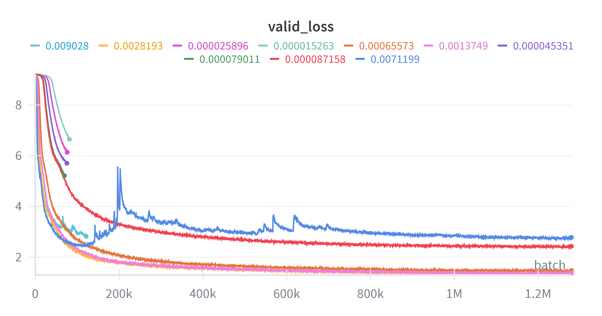
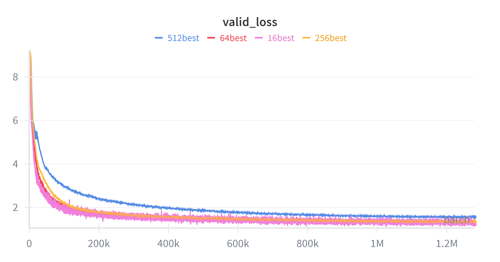

# writeup
## 2 BPE 
### 2.1
- (a) '\x00'
- (b) It's stringify of `__str__()` here.
- (c) '\x00' was hidden.

### 2.2
- (a) The range of utf-8 is much smaller.
- (b) it decodes bytes by bytes independently, but some code is longer than a byte. '牛'.encode('utf-8')
- (c) b'\xc0\x80'

### 2.5 Problem (train_bpe_tinystories): BPE Training on TinyStories
- script in solutions/test_train_bpe.sh
- (a) (with multiprocess in pre_tokenizer)
  - time: 38.12 s (wall clock), memory: 324692 kbytes (by usr/bin/time)
  - longest tokens: [b' accomplishment', b' disappointment', b' responsibility']
- (b) (by cProfile)
  - train_bpe: 27.9 s
    - pre_tokenize: 19.6 s
    - FasterCounter: 20+ s (?)

### Problem (train_bpe_expts_owt): BPE Training on OpenWebText
- my os break down few times
- (a)
  - use FasterCounter.most_common_1() with O(logn), so the whole token merging is O(nlogn)
  - it seems that merging is slower at the beginning, since more count of token pairs need to change.
  - it can be proved that the count of token pairs no increase with merging.
  - time: 2h22m, memory: 42319768kbytes (by usr/bin/time)
  - longest tokens: [b'\xc3\x83\xc3\x82\xc3\x83\xc3\x82\xc3\x83\xc3\x82\xc3\x83\xc3\x82\xc3\x83\xc3\x82\xc3\x83\xc3\x82\xc3\x83\xc3\x82\xc3\x83\xc3\x82\xc3\x83\xc3\x82\xc3\x83\xc3\x82\xc3\x83\xc3\x82\xc3\x83\xc3\x82\xc3\x83\xc3\x82\xc3\x83\xc3\x82\xc3\x83\xc3\x82\xc3\x83\xc3\x82' ('ÃÂÃÂÃÂÃÂÃÂÃÂÃÂÃÂÃÂÃÂÃÂÃÂÃÂÃÂÃÂÃÂ' in utf-8), b'----------------------------------------------------------------']
- (b) 

### Time complexity analysis
- O(nlogn), n is the number of pre-token.
- | dataset | pre-token | time | t / (p * log(p))
  | - | - | - | - |
  | tinystories | 59933 | 38.12s | 4.01e-5 |
  | owt | 6601892 | 2h22m | 5.70e-5 |
  | owt(10000 vocab end) | 6601892 | 1h58m | 4.72e-5 |
- With the impact of python gc and cpu hopping, the time complexity fit data very well.

### 2.7 Problem (tokenizer_experiments)
- (a)(b) compression ratio
  | tokenizer \ docs | ts | owt |
  | - | - | - |
  | ts | 4.03 | 3.38 |
  | owt | 3.96 | 4.39 |

- (c) throughput
  | tokenizer \ docs | ts | owt |
  | - | - | - |
  | ts | 2.4e5 | 2.5e5 |
  | owt | 2.3e5 | 2.2e5 |

  - m = 825GB = 825 * (1024 ** 3) bytes = 885837004800 bytes
  - m / v = 3.9e6 s = 1069 h

- (d) 2 ** 16 = 65536, which greater than most vocab_size. Also, it is 2 bytes and easy to store.

## 3 Transformer
### 3.6 Problem (transformer_accounting)
- script in solutions/transformer_accounting.py
- (a) paras: 2127057600, memory: 7.9 GB
- (b) total_flops=4,352,275,251,200
```py
matrix_multiplies = {
    # layers_tuple: n, m, p
    # ...
    ('layers', '47', 'attn', 'q_proj'): (1024, 1600, 1600),
    ('layers', '47', 'attn', 'k_proj'): (1024, 1600, 1600),
    ('layers', '47', 'attn', 'v_proj'): (1024, 1600, 1600),
    ('layers', '47', 'attn', 'output_proj'): (1024, 1600, 1600),
    # QK
    ('layers', '47', 'attn'): (1024, 1024, 64, 25),
    ('layers', '47', 'ffn', 'w1'): (1024, 1600, 6400),
    ('layers', '47', 'ffn', 'w3'): (1024, 1600, 6400),
    ('layers', '47', 'ffn', 'w2'): (1024, 6400, 1600),
    ('lm_head',): (1024, 1600, 50257)
}
```
- (c) 
  - k := 2 * 1024 * 1600 * 1600
  - 1x TransformerBlock: 
    - attn: 4 * 2 * 1024 * 1600 * 1600 + 1024 * 1024 * 64 * 25 = 4.8k
    - ffn: 3 * 2 * 1024 * 1600 * 6400 = 12k
  - lm_head: 2 * 1024 * 1600 * 50257 = 31k
  - ffn in blocks requires most FLOPs
- (d) analysis
  - more: blocks, ffn
  - less: lm_head, attn
- (e) attn more
```
GPT-2 small :
lm_head   :       79,047,426,048 | 23.93 %
attn      :       77,309,411,328 | 23.41 %
ffn       :      173,946,175,488 | 52.66 %

GPT-2 medium :
lm_head   :      105,396,568,064 | 10.74 %
attn      :      257,698,037,760 | 26.25 %
ffn       :      618,475,290,624 | 63.01 %

GPT-2 large :
lm_head   :      131,745,710,080 |  6.10 %
attn      :      579,820,584,960 | 26.83 %
ffn       :    1,449,551,462,400 | 67.07 %

GPT-2 XL :
lm_head   :      164,682,137,600 |  3.78 %
attn      :    1,167,694,233,600 | 26.83 %
ffn       :    3,019,898,880,000 | 69.39 %

GPT-2 XL + :
lm_head   :    2,634,914,201,600 |  2.43 %
attn      :   57,337,813,401,600 | 52.95 %
ffn       :   48,318,382,080,000 | 44.62 %
```

## 4 Training
### 4.2 Problem (learning_rate_tuning)
- 1e1: slower
- 1e2: faster
- 1e3: diverge

### 4.3 Problem (adamwAccounting)
- (a)
  - parameters: $ d\_model \cdot (14 \cdot num\_layer \cdot d\_model + vocab + 1) $ (*4B)
    - Transformer block: $ 14 \cdot d\_model^2 $
      - RMSNorm: $ d\_model $
      - MHA: $ 4 \cdot d\_model^2 $
        - proj: $ 3 \cdot d\_model^2 $
        - $ Q^TK $: $ 0 $
        - softmax: $ 0 $
        - weighted sum of values: $ 0 $
        - output projection: $ d\_model^2 $
      - Position-wise feed-forward: $ 8 \cdot d\_model^2 $
        - W matrix: $ 8 \cdot d\_model^2 $
        - SiLU: $ 0 $
    - final RMSNorm: $ d\_model $
    - output embedding: $ d\_model \cdot vocab $
    - cross-entropy on logits: $ 0 $
  - activations: $ b \cdot c \cdot (2 \cdot l \cdot c \cdot h + (16 \cdot l + 1) \cdot d\_model + vocab + 1) $ (*4B)
    - Transformer block: $ b \cdot c \cdot (2 \cdot c \cdot h + 16 \cdot d\_model) $
      - RMSNorm: $ b \cdot c \cdot d\_model $
      - MHA: $ b \cdot c \cdot (2 \cdot c \cdot h + 5 \cdot d\_model) $
        - proj: $ 3 \cdot b \cdot c \cdot d\_model $
        - $ Q^TK $: $ b \cdot c^2 \cdot h $
        - softmax: $ b \cdot c^2 \cdot h $
        - weighted sum of values: $ b \cdot c \cdot d\_model $
        - output projection: $ b \cdot c \cdot d\_model $
      - Position-wise feed-forward: $ 9 \cdot b \cdot c \cdot d\_model $
        - W1 matrix multiply: $ 4 \cdot b \cdot c \cdot d\_model $
        - SiLU: $ 4 \cdot b \cdot c \cdot d\_model $
        - W2 matrix multiply: $ b \cdot c \cdot d\_model $
    - final RMSNorm: $ b \cdot c \cdot d\_model $
    - output embedding: $ b \cdot c \cdot vocab $
    - cross-entropy on logits: $ b \cdot c $
  - gradients: (= parameters)
  - optimizer state: (= 2 parameters)
  - total: (= 4 parameters + activations)
    - $ 4 \cdot d\_model \cdot (14 \cdot num\_layer \cdot d\_model + vocab + 1) + b \cdot c \cdot (2 \cdot l \cdot c \cdot h + (16 \cdot l + 1) \cdot d\_model + vocab + 1) $ (*4B)
- (b) $ 15'311'908'864 \cdot batch\_size + 28'811'750'400 $  (*4B), max batch size: 3
  ```py
  def memory_used(s,d,l,v,h,b,c):
      return s*(4*d*(14*l*d+v+1)+b*c*(2*l*c*h+(16*l+1)*d+v+1))
  ```
- (c) (= 14 parameters)
- (d) 4475 days

## 7 Experiments
### 7.2 Problem (learning_rate)


```bash
# 1) old script (batch_size: 256)
git checkout f2ae9e1
# at base dir
uv run solutions/trainer.py --config-path configs/std-config.yaml --test
# go back
git checkout -

# 2) new script without running
# batch_size: {1,16,64,256,512}
uv run solutions/lr_tuning_experiment.py --config-path configs/std-config.yaml
```

- (a) lr = 0.002819 (batch_size = 256)
- (b) best = 0.002819, best <= min_diverge <= 0.00712

### 7.2 Problem (batch_size_experiment)


| batch_size | best_lr | min_valid_loss |
| - | - | - |
| 1 | (killed since too slow) |
| 16 | 3.74e-4 | 1.212 |
| 64 | 6.60e-4 | 1.332 |
| 256 | 2.82e-3 | 1.361 |
| 512 | 5.62e-3 | 1.557 |

The greater batch_size is, the greater best_lr is and the greater valid_loss is.

